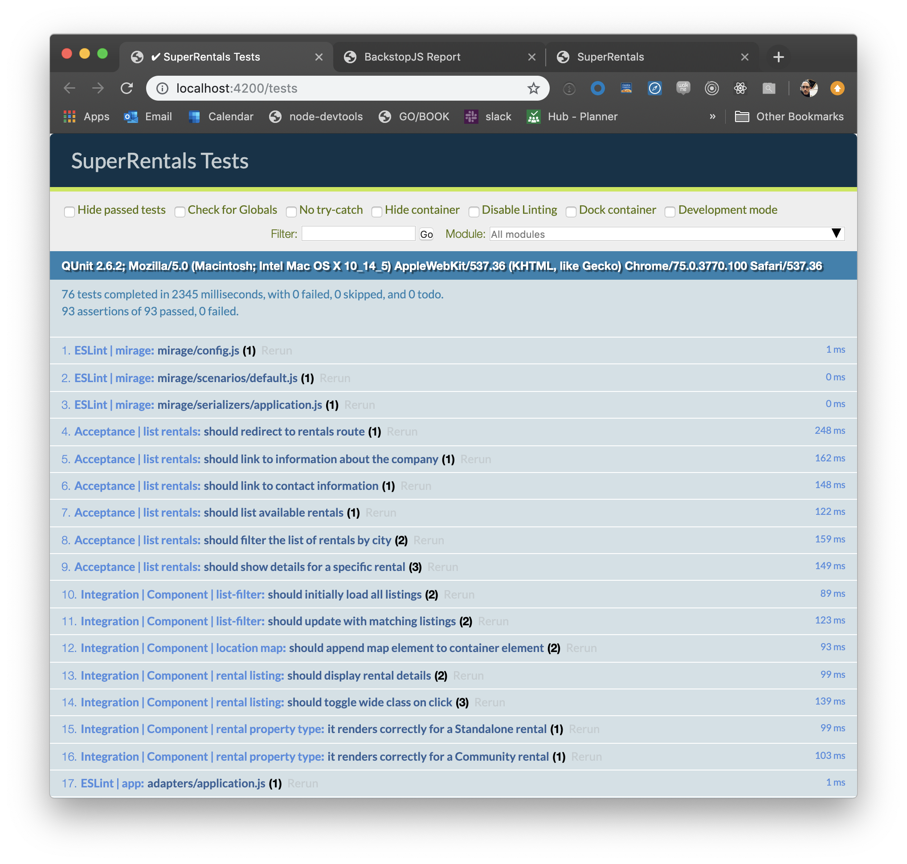
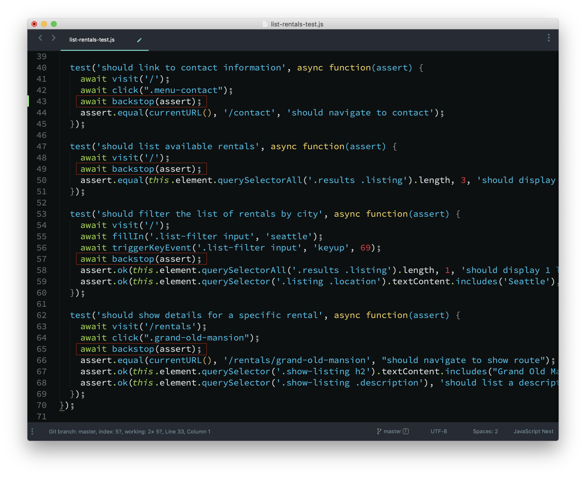
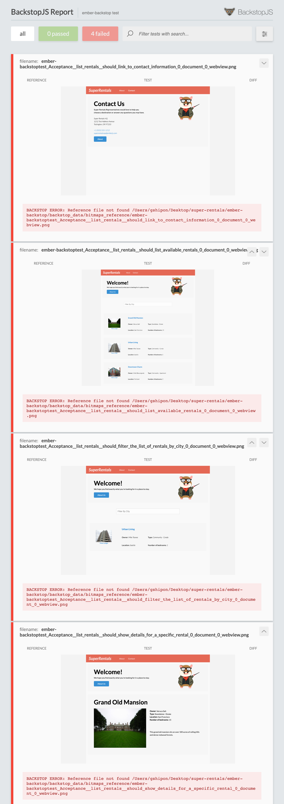
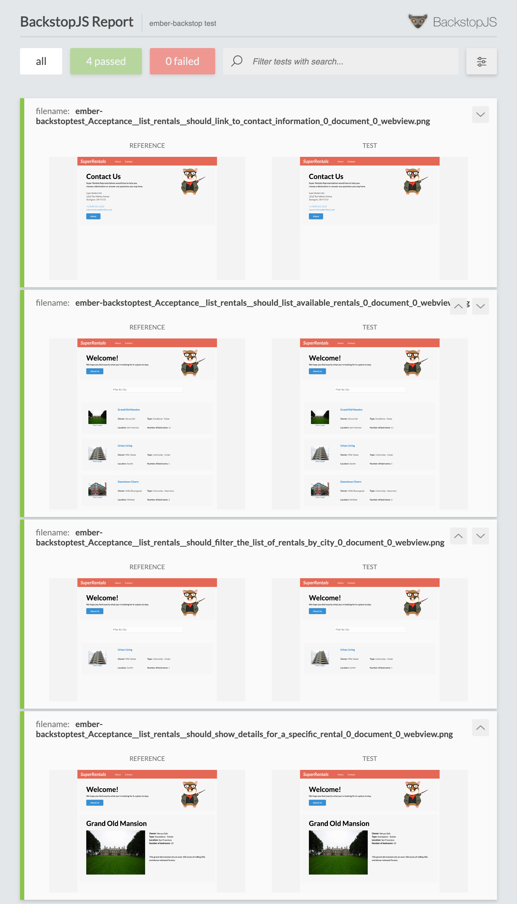
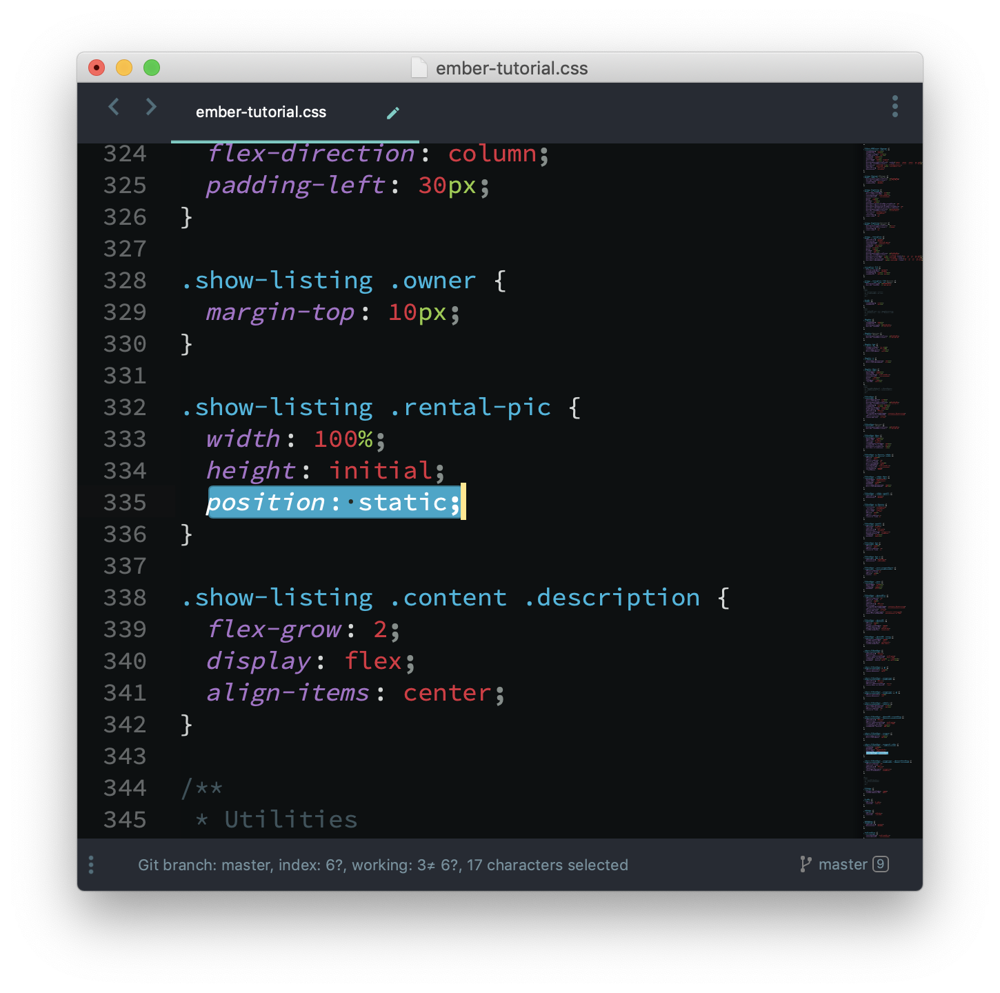
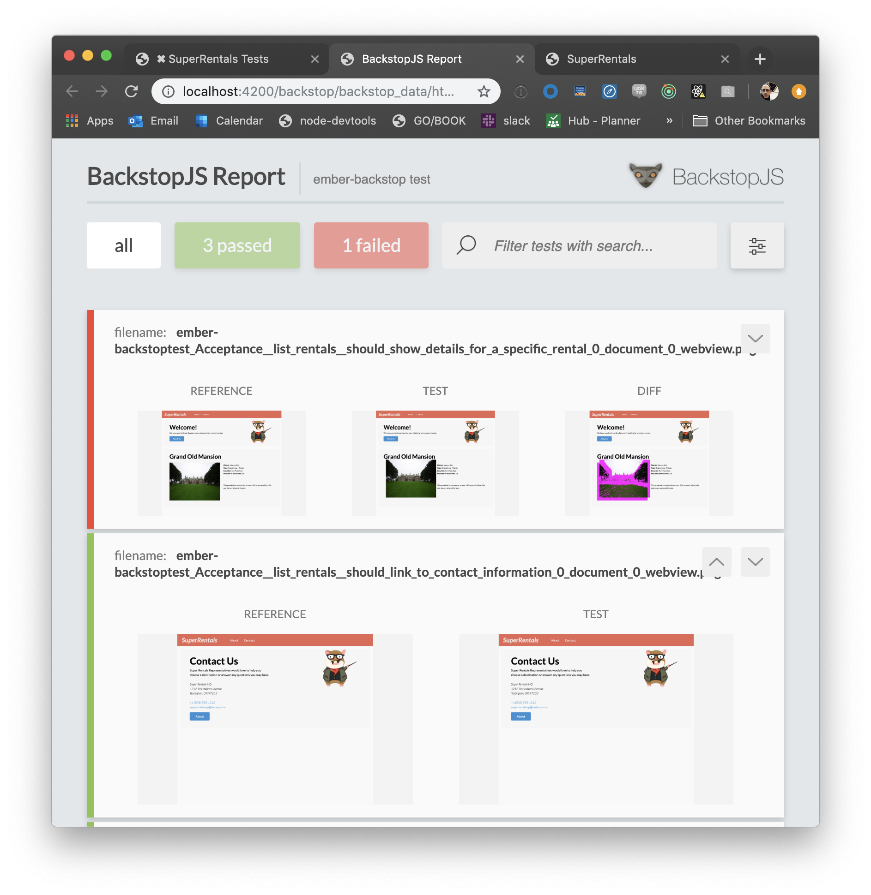

# Ember-Backstop Visual Regression Test Tutorial

This tutorial starts with a fork of the EmberJS **Super Rentals** tutorial. We added the ember-backstop test helper to the project and configured everything for you so you can get right in and experience visual testing with everything all set up. Awesome.

*This demo is based on the original working repository for the EmberJS Super Rentals tutorial. More info at https://guides.emberjs.com/current/tutorial/ember-cli/.*

## Prerequisites

You will need the following things properly installed on your machine.

* [Git](https://git-scm.com/)
* [Node.js](https://nodejs.org/)
* [Yarn](https://yarnpkg.com/)
* [Ember CLI](https://ember-cli.com/)
* [Google Chrome](https://google.com/chrome/)

## Installation

First, find a spot on your machine where you want to put the demo -- desktop works fine...

```
git clone https://github.com/garris/super-rentals
cd super-rentals
yarn install
```

## Start Backstop-Remote Service and Ember Server
In the project root run the following to start the Backstop-Remote service...

```
ember backstop-remote
```

Then, in another window start ember...

```
ember serve
```

Ok, let's get to the tests!

## Add Visual Regression Tests

### Start by running the basic tests

So, by now your server is running and the demo app will be hittable at [http://localhost:4200](http://localhost:4200).  Go ahead and click around there. We'll wait...

The ordinary Ember tests are here, all set up for you -- [http://localhost:4200/tests](http://localhost:4200/tests). Go ahead hit that link and watch everything run.  Here is the testem test report that you should see...



### Next, set-up the ember-backstop test helper

First, open `tests/acceptance/list-rentals-test.js` and add the following import statement to the top of the file...

```
import backstop from 'ember-backstop/test-support/backstop';
```

... and here is an example of how you add the screenshot helper to your tests...

```
  test('it renders the thing', async function(assert) {
    await visit('/sales/company/11102');
    await backstop(assert);
    assert.dom('#myFancyElement').Exists();
  });
```

Go ahead and add it to the last four tests inside `tests/acceptance/list-rentals-test.js` as shown below...



Ok, the helper is set up -- let's now set up the visual tests.

### Setting up ember-backstop tests

The first time you run an ember-backstop after set-up the test will fail -- so go ahead! Fail fast! Rerun your testem tests -- it should look like below...


Testem is showing failed BackstopJS tests -- which have failed because we have not yet told BackstopJS what our reference images should look like. Let's fix that -- open the BackstopJS report in a browser tab [http://localhost:4200/backstop/backstop_data/html_report/](http://localhost:4200/backstop/backstop_data/html_report/)

That should look like this...


These screens look good -- lets approve them so that future screenshots will be compared against these.  

In another window approve the tests with...

```
ember backstop-approve
```

Now run tests again -- they should all pass!  

Refresh the BackstopJS report once tests have completed.  It should look like this...



**Congratulations! BackstopJS tests are all set up!**  Just add a `backstop()` helper anywhere and a screenshot will capture the rendered visual state at that time.

Go forth now and experiment with your new visual powers! 

As a suggestion you could open up the project css file at `vendor/ember-tutorial.css`. Go ahead and delete the `postion: static;` as shown in the following file. See if BackstopJS can find the changes... 😉



The above changes is caught by BackstopJS...



## Further Reading / Useful Links

* [ember.js](https://emberjs.com/)
* [ember-cli](https://ember-cli.com/)
* Development Browser Extensions
  * [ember inspector for chrome](https://chrome.google.com/webstore/detail/ember-inspector/bmdblncegkenkacieihfhpjfppoconhi)
  * [ember inspector for firefox](https://addons.mozilla.org/en-US/firefox/addon/ember-inspector/)
